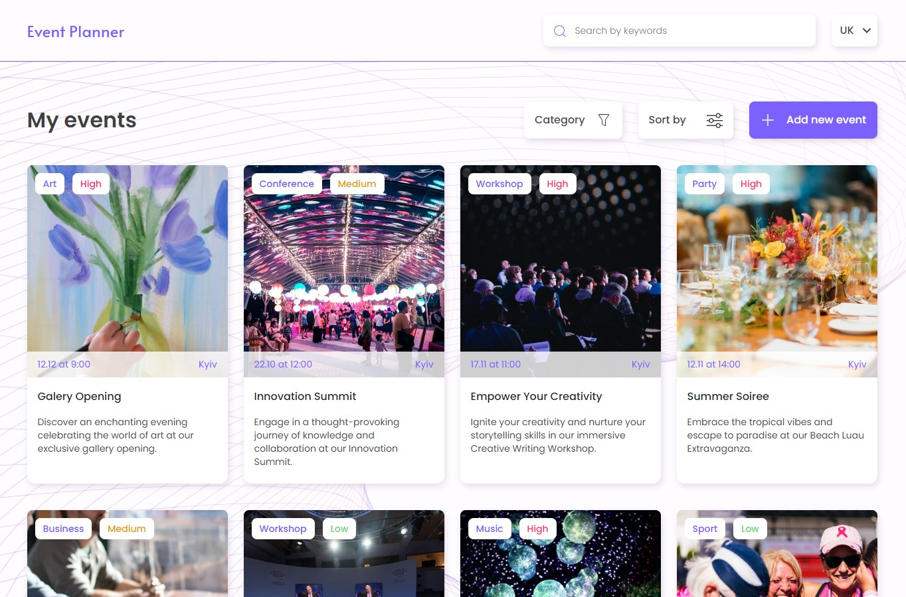
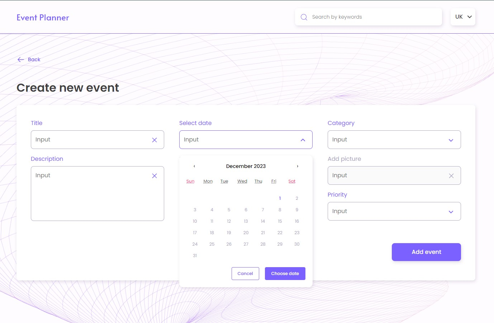

# Event Planner

## This is a web application that allows users to plan and organize events.

## <ul>Main functionality:</ul>

<li>On the main page, you can view all upcoming events.</li>
<li>It is possible to add a new event by filling out the information form and choosing the priority and category of the event.</li>

<li>It is possible to view detailed information about the event by clicking on the button "More info" on the card.</li>
<li>On the details page, you can delete the event or make changes by clicking the button "Edit".</li>

## Used technologies:

- React.js
- Redux-toolkit
- React-Router-Dom
- Styled Components
- React-hook-form
- React-hot-toast for toast notifications

The stylization implements a responsive layout with three breakpoints: 320px, 768px, 1280px.
Use the Mobile first approach.
